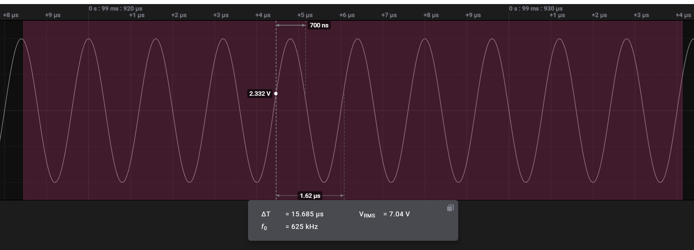

# Analog Fundamental Frequency
  
This uses [`numpy.correlate`](https://numpy.org/doc/stable/reference/generated/numpy.correlate.html) to find the fundamental frequency of the selected analog range.

Autocorrelation is not ideal for all fundamental frequency calculations.

Since I couldn't remember how to perform the calculation from my college days, the extra math was taken from [here](https://gist.github.com/endolith/255291).

This analog measurement extension will look like this:

For details on the specific calculation used, please browse the repository source.

This measurement is too slow for long sections of data. For larger sections, I recommend exporting the analog channel to CSV, and processing the data in python or another tool.